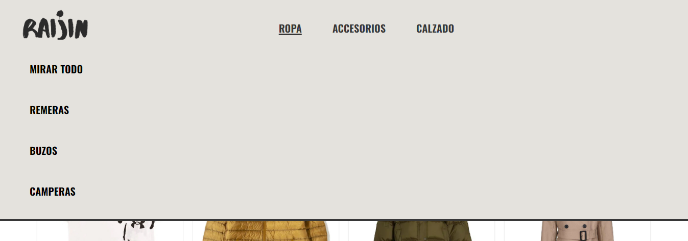
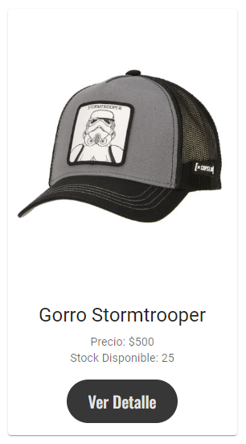
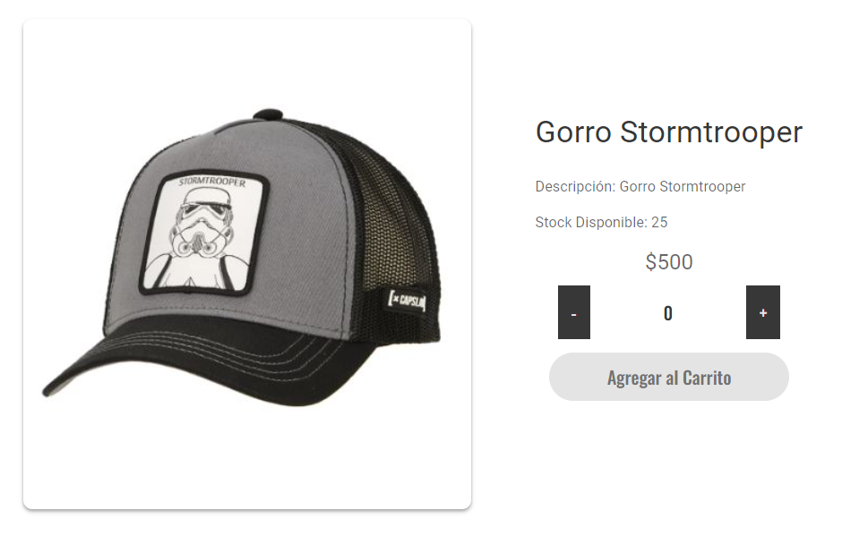
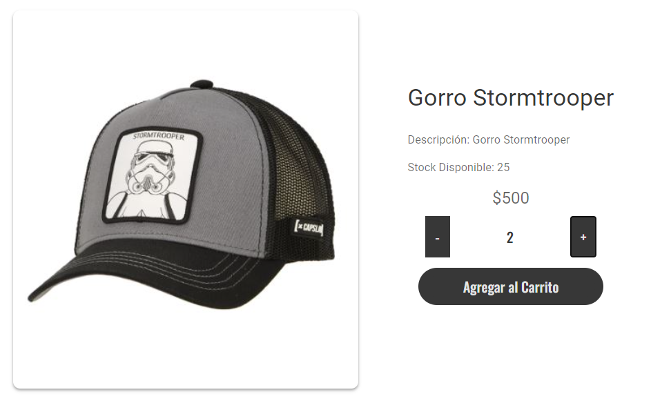
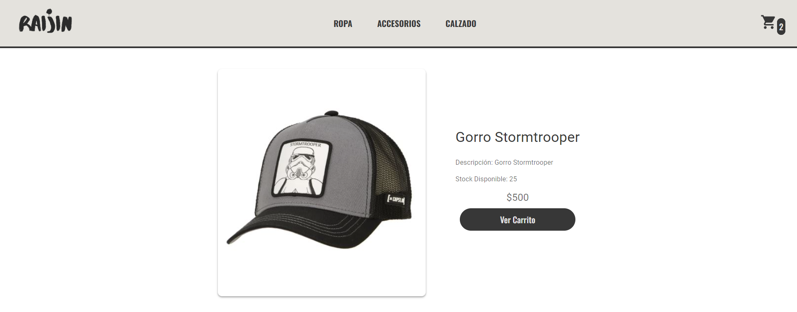
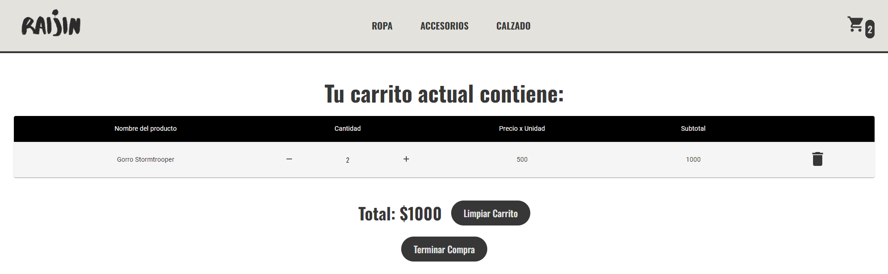
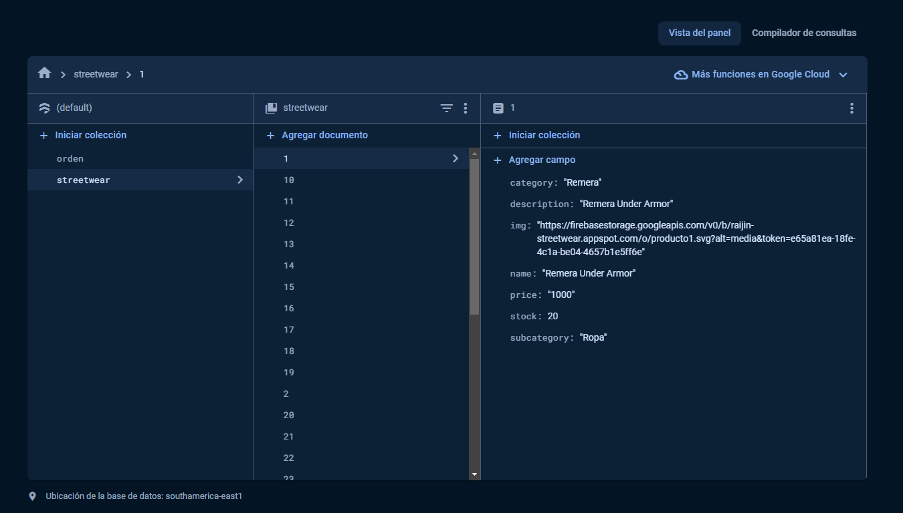
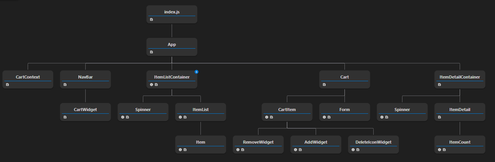

# Raijin Streetwear - Ecommerce

## Tabla de Contenido

- [Descripción](#descripción)
- [Instalación y uso](#instalación-y-uso)
- [Dependencias](#dependencias)
- [Funcionamiento de la página](#funcionamiento-de-la-página)
- [Organización en Firebase](#organización-en-firebase)
- [React Tree](#react-tree)

## Descripción:
Raijin Streetwear es tu nueva opción para sumergirte en el mundo de la moda urbana. Nos especializamos en ofrecer vestimenta de alta calidad, incluyendo ropa, accesorios y calzado que se enfocan en ofrecer una esencia de estilo único.

Esta página web fue diseñada para poder empezar nuestro emprendimiento en el mundo del ecommerce, con el propósito de acercar nuestras exclusivas colecciones a un público más amplio por todo el país.

[Volver a Tabla de Contenido](#tabla-de-contenido)

## Instalación y uso:
En el directorio del proyecto se pueden ejecutar los siguientes comandos:

### `npm install`

Este comando permite instalar todas las dependecias del proyecto.\
Es necesario ejecutra este comando antes de ejecutar el `npm start` para que la página web funcione.

### `npm start`

Hace que la aplicación corra en modo desarollo.\
Esto lo va a hacer en el puerto: [http://localhost:3000](http://localhost:3000)\
Puedes hacer click en el link una vez ejecutado el comando para poder acceder a la página.

[Volver a Tabla de Contenido](#tabla-de-contenido)

## Dependencias:
- Material UI
- Animate CSS
- Firebase
- React

[Volver a Tabla de Contenido](#tabla-de-contenido)

## Funcionamiento de la página
En Raijin Streetwear, nos esforzamos por proporcionar a nuestros clientes una experiencia de compra intuitiva y sin complicaciones. Aquí hay un vistazo al flujo de información de nuestro ecommerce:

**1.** **Navegación por Categorías:** Explora fácilmente nuestras colecciones de ropa, accesorios y calzado mediante los botones en la parte superior de la página. Estas a su vez se subdividen para poder filtrar los productos a preferencia del usuario.\
Como se ve en la imagen:

**2.** **Detalles del Producto:** Haz clic en "Ver Detalle" en cualquier producto para obtener más información del mismo, incluyendo Nombre, Descripción, Stock disponible y Precio x unidad.\
Como se muestra en las siguientes imagenes:

**3.** **Agregar al Carrito:** Una vez ingresado a la información del producto deseado, puedes agregar el mismo a tu "Carrito". Para poder realizar esta acción debes seleccionar la cantidad de unidades que quieres comprar.\
Como se muestra en la siguiente imagen:

**4.** **Ver tu Carrito:** Una vez clickeamos en el botón "Agregar al carrito", podremos o bien ir al carrito desde un nuevo botón que aprece o desde el icono de Carrito arriba a la derecha.\
Como se muestra en la siguiente imagen:

**5.** **Ver detalle del Carrito:** Cuando la persona termine de agregar todos sus productos al carrito, si desea ver su detalle solo debe tocar esos botones anteriormente mencionados y lo llevaran a su "Detalle del carrito". 
Donde podrá ver sus productos, ver el subtotal de cada producto, el total a pagar y un botón para efectuar la transacción.
A su vez, el usuario podrá decidir si aumentar la cantidad del producto, disminuirla, eleminarla por completo o mismo limpiar su carrito para no tener ningun producto.\
Como se muestra en la siguiente imagen:

[Volver a Tabla de Contenido](#tabla-de-contenido)

## Organización en Firebase:
Toda nuestra base de datos esta subida a Firebase y seguimos la siguiente estrectura:

Tenemos 2 collecciones:
- **Orden:** Donde tenemos registro de todas las ordenes de compras hechas por los usuarios. Donde guardamos un ID que genera Firebase y dentro de este ID vamos a tener los "Datos del comprador" (nombre, apellido, email y telefono) y el "Carrito" (con todos los items que compró)

- **Streetwear:** Donde tenemos registro de todos los productos que tenemos a disposición dentro de nuestro ecommerce. Cada uno de ellos tiene un numero como ID (como se ve en la imagen de arriba) y dentro de estos vamos a guardar sus datos (precio, nombre, descripción, etc.)

[Volver a Tabla de Contenido](#tabla-de-contenido)

## React Tree:
En la siguiente imagen se verá una representación grafica que ilustra la organización y jerarquia de los datos dentro del proyecto.

[Volver a Tabla de Contenido](#tabla-de-contenido)